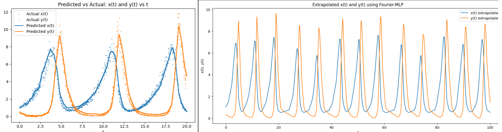

<div style="display: flex; justify-content: space-around; align-items: center;">
  
</div>

## 📜 mlp-timeseries-interpolation-extrapolation
#### 📌 Summary  
Implementation of a Multi-Layer Perceptron (MLP) using PyTorch for modeling, interpolation, and extrapolation of bivariate time series data `(x(t), y(t))` given scalar time input `t`.

#### 🧠 Overview  
This project leverages a deep learning-based MLP (Multi-Layer Perceptron) model to approximate noisy 2D time series data using Python and PyTorch. The model is trained to learn a mapping from scalar input time `t` to two-dimensional spatial coordinates `x` and `y`.  

This effectively enables:
- **Interpolation** — Estimating missing or unobserved values within the data range where 0<t<20
- **Extrapolation** — Predicting values beyond the existing time boundaries where 0<t<100

The original dataset (data.csv)[https://gist.github.com/tmramalho/51733432c88e2b834dbd70353849f887] is a noisy CSV file containing columns `t`, `x`, and `y`. Data preprocessing includes:
- Cleaning invalid characters
- Ensuring numerical consistency
- Plotting for visual inspection

The MLP model consists of several fully connected layers activated with ReLU, trained to minimize mean squared error between predicted and actual positions. The project was implemented and tested entirely in a Google Colab notebook environment.

**Model Architecture Summary - Interpolation**
- Input: Scalar value `t`
- Output: 2D vector `(x, y)`
- Layers:
  1. Dense Layer → 64 units
  2. Dense Layer → 128 units
  3. Dense Layer → 256 units
  4. Output Layer → 2 units `(x, y)`
- Activation: ReLU (in all hidden layers)

**Loss Function**
- Mean Squared Error (MSE)

**Optimization**
- Adam optimizer

**Model Architecture Summary - Extrapolation**
- Feature Extraction : Fourier Features
- Input: Scalar value `t`
- Output: 2D vector `(x, y)`
- Layers:
  1. Dense Layer → 128 units
  2. Dense Layer → 256 units
  3. Dense Layer → 61 units
  4. Output Layer → 2 units `(x, y)`
- Activation: ReLU (in all hidden layers)

**Loss Function**
- Mean Squared Error (MSE)

**Optimization**
- Adam optimizer

#### 🎯 Use Cases
- Time series trajectory reconstruction
- Missing data interpolation
- Forecasting 2D trajectories (e.g., object motion)
- Learning noisy curve patterns
- Educational demonstration of function approximation with deep learning

#### 🟢 Project Status
- Current Version: V1.0

#### 📂 Repository Structure
```
mlp-timeseries-interpolation-extrapolation/
├── README.md
├── LICENSE
├── .gitignore                  
├── assets/                      
│   └── images/
└── notebooks/               
    └── mlp_interpolation_extrapolation.ipynb
```

### ✨ Features
- ✅ Cleaned time series dataset
- ✅ MLP model for 2D prediction
- ✅ Visualization of real vs predicted curves
- ✅ Interpolation & extrapolation demonstration

🛠️ In progress:
- Performance comparison with other regressors

---

### 🚀 Getting Started

#### 📚 Knowledge & Skills Required
- Python programming
- Basic ML/DL concepts
- Understanding of time series and regression

#### 💻 Software Requirements
- Jupyter Notebook or Colab
- Python ≥ 3.8

#### 🛡️ Tech Stack
- Language: Python
- Libraries: pandas, numpy, matplotlib, scikit-learn
- Deep Learning: PyTorch

#### 🔍 Modules Breakdown

<b>📥 (1) Data Preprocessing:</b>
- Load and clean dataset (`data.csv`)
- Remove rows with invalid or missing entries
- Convert all values to numerical type
- Plot `x(t)` and `y(t)` for exploration

<b>🤖 (2) MLP Model - Interpoaltion:</b>
- Multi-layer fully connected neural network
- Input: scalar `t`, Output: vector `(x, y)`
- Layers: 1 → 64 → 128 → 256 → 2
- ReLU activations
- Output: 2D prediction of time-series position

<b>📉 (3) Loss & Optimization:</b>
- Loss Function: Mean Squared Error
- Optimizer: Adam

<b>📊 Evaluation:</b>
- Plotting predicted vs true curves
- Visualization for both interpolation & extrapolation

---

#### ⚙️ Installation
```bash
git clone https://github.com/pointer2Alvee/mlp-timeseries-interpolation-extrapolation.git
cd mlp-timeseries-interpolation-extrapolation

# Recommended: Use virtual environment
pip install -r requirements.txt
```

##### 🖇️ requirements.txt (core packages):
```
pandas
numpy
matplotlib
scikit-learn
torch
```

##### 💻 Running the App Locally
1. Open the Jupyter notebook `mlp-timeseries.ipynb`
2. Run all cells sequentially
3. Visualize plots of predicted vs actual time series

---

### 📖 Usage
- Open the project in **Google Colab** or **Jupyter Notebook**
- Adjust model layers or learning rate as needed
- Upload your own time series CSV (with `t`, `x`, `y` columns) for testing

---

### 🧪 Sample Topics Implemented
- ✅ Deep MLP for regression
- ✅ Time series interpolation/extrapolation
- ✅ PyTorch model training
- ✅ Data visualization for time series

---

### 🧭 Roadmap
- [x] Basic MLP model for 2D regression
- [x] Time series interpolation & extrapolation
- [x] Add Fourier-based feature transformation
- [ ] Compare with traditional regressors (SVR, GPR)

---

### 🤝 Contributing
Contributions are welcomed!
1. Fork the repo  
2. Create a branch: `git checkout -b feature/YourFeature`  
3. Commit changes: `git commit -m 'Add some feature'`  
4. Push to branch: `git push origin feature/YourFeature`  
5. Open a Pull Request

---

### 📜 License
Distributed under the MIT License. See `LICENSE` for more information.

---

### 🙏 Acknowledgements
- PyTorch Team
- Kaggle Community
- Open-source contributors and visualization libraries

